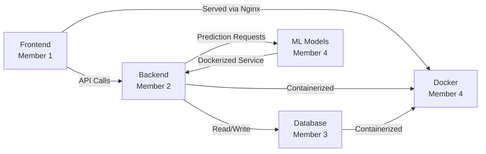

<![CDATA[# 🏥 Swapna — Smart Healthcare Platform

> A full-stack, AI-powered healthcare web application built to solve real-world medical challenges commonly seen in hackathon problem statements — from appointment booking and telemedicine to disease prediction and health analytics.

---

## 🚀 Project Overview

**Swapna** is a comprehensive healthcare platform that brings together patients, doctors, and administrators under one unified system. The goal is to build a production-grade medical web app that covers the most demanded features in health-tech hackathons, including:

- 🩺 **Appointment Booking & Management** — Schedule, reschedule, and cancel appointments with doctors
- 📹 **Telemedicine / Video Consultation** — Real-time video calls between patients and doctors
- 🤖 **AI Disease Prediction** — ML models that predict diseases from symptoms, lab reports, or medical images
- 📊 **Health Dashboard & Analytics** — Visualize patient health metrics, trends, and insights over time
- 💊 **E-Prescription & Medicine Reminders** — Digital prescriptions with automated reminders
- 🗂️ **Electronic Health Records (EHR)** — Secure storage and retrieval of patient medical history
- 🔐 **Role-Based Authentication** — Separate portals for patients, doctors, and admins
- 🏥 **Hospital / Clinic Finder** — Location-based search with maps integration
- 🧪 **Lab Report Upload & Analysis** — OCR + AI-powered report parsing
- 📱 **Responsive Design** — Mobile-first UI that works across all devices

---

## 💡 Suggested Tech Stack

> _Final stack to be confirmed — suggestions below:_

| Layer              | Suggested Technologies                                      |
| ------------------ | ----------------------------------------------------------- |
| **Frontend**       | React.js / Next.js, Tailwind CSS, Framer Motion, Chart.js   |
| **Backend**        | Node.js + Express / FastAPI (Python)                         |
| **Database**       | PostgreSQL (relational), MongoDB (documents), Redis (cache)  |
| **ML / AI Models** | Python, scikit-learn, TensorFlow / PyTorch, Flask API        |
| **Auth**           | JWT, OAuth 2.0, bcrypt                                       |
| **Video Calls**    | WebRTC / Twilio / Agora SDK                                  |
| **DevOps**         | Docker, Docker Compose, GitHub Actions CI/CD, Nginx          |
| **Cloud**          | AWS / GCP / Azure (hosting, storage, model serving)          |
| **Other**          | Socket.io (real-time), Tesseract OCR, Leaflet.js (maps)     |

---

## 👥 Team Structure & Responsibilities

The project is divided into **4 interrelated domains**, each assigned to a team member. Every member's work feeds into the others — the frontend consumes the backend APIs, the backend reads/writes to the database, the ML models are served through the backend, and Docker ties everything together for deployment.

```
┌─────────────────────────────────────────────────────────┐
│                    SWAPNA ARCHITECTURE                   │
│                                                         │
│   ┌──────────┐    ┌──────────┐    ┌──────────────────┐  │
│   │ Frontend │◄──►│ Backend  │◄──►│  Database (DBMS) │  │
│   │ (Member 1)│   │(Member 2)│    │   (Member 3)     │  │
│   └──────────┘    └────┬─────┘    └──────────────────┘  │
│                        │                                 │
│                   ┌────▼─────┐                           │
│                   │ ML Models│                           │
│                   │(Member 4)│                           │
│                   └──────────┘                           │
│                                                         │
│         🐳 Docker & DevOps — shared across team         │
└─────────────────────────────────────────────────────────┘
```

---

### 👤 Member 1 — Frontend & UI/UX

**Domain:** User Interface, Client-Side Logic, Design System

| Area                   | Details                                                         |
| ---------------------- | --------------------------------------------------------------- |
| **Core**               | Build all pages — landing, dashboard, appointments, profile     |
| **Components**         | Reusable UI components, forms, modals, navigation               |
| **State Management**   | Global state for auth, user data, notifications                 |
| **API Integration**    | Connect frontend to backend REST / GraphQL APIs                 |
| **Real-time Features** | Chat UI, video call interface, live notifications               |
| **Responsiveness**     | Mobile-first, cross-browser compatible layouts                  |
| **Charts & Visuals**   | Health dashboards with interactive charts and graphs             |

**Key Deliverables:**
- Patient portal, Doctor portal, Admin panel
- Appointment booking flow
- Health dashboard with charts
- Video call UI (WebRTC integration)

---

### 👤 Member 2 — Backend & API Development

**Domain:** Server-Side Logic, REST APIs, Authentication, Business Logic

| Area                | Details                                                            |
| ------------------- | ------------------------------------------------------------------ |
| **API Design**      | RESTful endpoints for all features (CRUD for users, appointments)  |
| **Authentication**  | JWT-based auth, role-based access control (patient/doctor/admin)   |
| **Business Logic**  | Appointment scheduling, prescription management, notifications     |
| **File Handling**    | Upload/download lab reports, profile images, prescriptions         |
| **Real-time**       | Socket.io for chat, notifications, live status updates             |
| **ML Integration**  | Serve ML model predictions via API routes                          |
| **Security**        | Input validation, rate limiting, CORS, HTTPS                      |

**Key Deliverables:**
- Complete REST API with Swagger/OpenAPI docs
- Auth system with role-based middleware
- Integration layer for ML model serving
- Real-time notification system

---

### 👤 Member 3 — Database & Data Management (DBMS)

**Domain:** Schema Design, Queries, Data Integrity, Migrations

| Area                   | Details                                                        |
| ---------------------- | -------------------------------------------------------------- |
| **Schema Design**      | ER diagrams, normalize tables for users, doctors, appointments |
| **ORM / Queries**      | Sequelize / Prisma / SQLAlchemy models and query optimization  |
| **Data Relationships** | Foreign keys, joins, cascading deletes for related records     |
| **Migrations**         | Version-controlled schema migrations                           |
| **Seeding**            | Sample/test data for development and demos                     |
| **Caching**            | Redis for session storage, frequent queries, rate limiting     |
| **Backups & Security** | Data encryption at rest, automated backup strategy             |

**Key Deliverables:**
- Complete ER diagram and database schema
- ORM models for all entities
- Optimized queries and indexes
- Seed scripts for demo data

---

### 👤 Member 4 — ML/AI Models & DevOps

**Domain:** Machine Learning Models, Docker, CI/CD, Deployment

| Area                    | Details                                                         |
| ----------------------- | --------------------------------------------------------------- |
| **Disease Prediction**  | Train models on symptom/disease datasets (classification)       |
| **Image Analysis**      | CNN-based models for X-ray / skin lesion analysis               |
| **Report Parsing**      | OCR pipeline to extract data from uploaded lab reports           |
| **Model Serving**       | Flask/FastAPI microservice to expose model predictions           |
| **Docker**              | Dockerfiles for frontend, backend, DB, ML service               |
| **Docker Compose**      | Multi-container orchestration for full-stack local dev          |
| **CI/CD**               | GitHub Actions — lint, test, build, deploy on push              |
| **Deployment**          | Cloud deployment scripts (AWS/GCP), Nginx reverse proxy        |

**Key Deliverables:**
- Trained disease prediction model (≥ 85% accuracy)
- Dockerized full-stack setup (`docker-compose up` one-command run)
- CI/CD pipeline with automated tests
- Deployment-ready cloud configuration

---

## 🔗 How the Domains Connect



| Interaction               | Description                                                  |
| ------------------------- | ------------------------------------------------------------ |
| Frontend ↔ Backend        | REST API calls for all data operations                       |
| Backend ↔ Database        | ORM queries, migrations, data validation                     |
| Backend ↔ ML Models       | HTTP calls to ML microservice for predictions                |
| Docker ↔ All Services     | Every service runs in its own container, orchestrated by Compose |
| CI/CD ↔ GitHub            | Auto-deploy on push to main branch                           |

---

## 📁 Proposed Project Structure

```
swapna/
├── frontend/              # React/Next.js application
│   ├── src/
│   │   ├── components/    # Reusable UI components
│   │   ├── pages/         # Route-based pages
│   │   ├── hooks/         # Custom React hooks
│   │   ├── services/      # API service functions
│   │   └── styles/        # Global styles & design tokens
│   └── Dockerfile
│
├── backend/               # Node.js/Express or FastAPI server
│   ├── routes/            # API route handlers
│   ├── controllers/       # Business logic
│   ├── middleware/         # Auth, validation, error handling
│   ├── models/            # ORM/DB models
│   ├── utils/             # Helper functions
│   └── Dockerfile
│
├── database/              # Database configs & scripts
│   ├── migrations/        # Schema migration files
│   ├── seeds/             # Seed/demo data
│   └── schema.sql         # Raw schema (reference)
│
├── ml-service/            # ML model training & serving
│   ├── models/            # Trained model files (.pkl, .h5)
│   ├── notebooks/         # Jupyter notebooks for experiments
│   ├── api/               # Flask/FastAPI prediction endpoints
│   ├── data/              # Training datasets
│   └── Dockerfile
│
├── docker-compose.yml     # Multi-container orchestration
├── .github/workflows/     # CI/CD pipeline configs
├── docs/                  # ER diagrams, API docs, architecture
└── README.md
```

---

## 🛠️ Getting Started

```bash
# Clone the repository
git clone https://github.com/<your-org>/swapna.git
cd swapna

# Run the full stack with Docker
docker-compose up --build

# Or run individual services
cd frontend && npm install && npm run dev
cd backend && npm install && npm run dev
cd ml-service && pip install -r requirements.txt && python app.py
```

---

## 📝 Contributing

1. Create a feature branch from `main`: `git checkout -b feature/<your-feature>`
2. Commit with clear messages: `git commit -m "feat: add appointment booking API"`
3. Push and open a Pull Request for review
4. At least one other team member must approve before merging

---

## 📄 License

This project is for educational and hackathon purposes.

---

<p align="center">
  Built with ❤️ by <strong>Team Swapna</strong>
</p>
]]>
